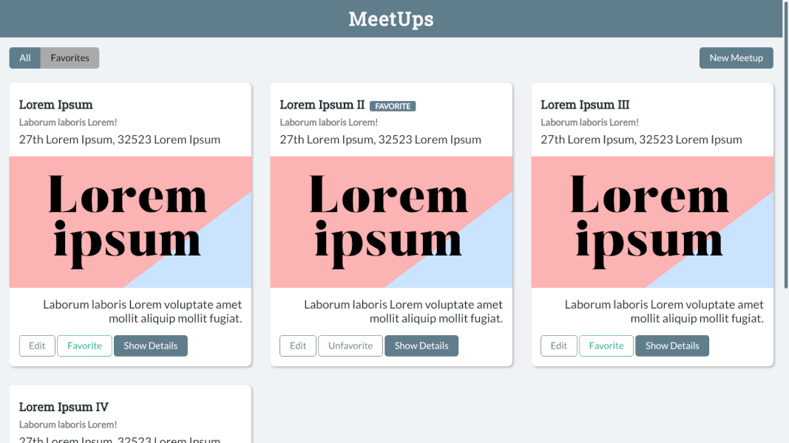

# Svelte MeetUp

A simple MeetUps app built with Svelte.

<h2 align="center">
  
  <br>
</h2>


## Installation & Usage

```bash
git clone https://github.com/armanabkar/svelte-meetup.git
cd svelte-meetup
npm install # or yarn!
npm run dev
```

Open up [localhost:5000](http://localhost:5000) and start clicking around.
